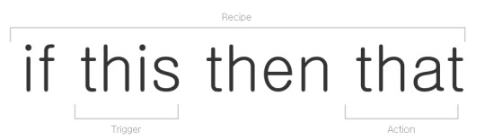

# 코로나 알림봇 (IFTTT, LINE notify)

예전부터 한 번 써보려고 했었던 IFTTT 서비스가 있는데, IFTTT는 IF This Then That 의 약자로

내가 설정한 이벤트가 발생하면 (IF-This) 내가 설정한 행동을(Then That) 자동으로 발생시켜주는 앱이다.

> 'IF' 'T'his 'T'hen 'T'hat
IFTTT의 이름은 'IF' 'T'his 'T'hen 'T'hat에서 따왔다. 중고등학교 영어 시간 때 배웠던 조건문이다. 이런 조건일 때, 이런 행동을 하라는 것이다. '페이스북에 내 이름이 태그된 사진이 올라오면(조건), 그 사진을 드롭박스에 저장하라(행동)' 같은 식이다.

따라서 IFTTT는 '채널', '조건', '행동' 세 가지가 핵심 요소다. 채널은 행동의 요소가 되는 할 앱이나 기능이다. 페이스북, 에버노트, 메일, 드롭박스, 인스타그램, 원노트, 유튜브 등 다양한 주요 앱과 내 위치, 사진, 연락처, iOS 미리알림 등 기본 기능을 포함해 현재 채널 수는 160개에 달한다(1월 23일 기준).

[동아일보 - [추천앱] IFTTT, 네가 다 알아서 해줘](https://news.naver.com/main/read.nhn?mode=LSD&mid=sec&sid1=105&oid=020&aid=0002732606)

앱을 활용하여 국내 코로나 환자 현황에 변화가 생기면 LINE으로 알림 메세지를 보내주는 간단한 봇을 제작해 본다.

## Step 0. IFTTT 서비스 생성

[IFTTT 바로가기](https://ifttt.com/)

△ 사이트를 방문하여 회원가입 해줍니다.

△ 회원가입 후 새로운 레시피를 생성해줍니다. 

△ +This 클릭하여 이벤트를 설정해줍니다

△ Webhooks 검색 후 선택

△ Connect 클릭

△ Receive a web request 클릭

△ Event Name 입력 후 Create Trigger (event 이름은 기억해두자)

△ If + Then 사이에 Web hooks 아이콘이 생겼다면 Trigger 생성완료

이제 That 앞에  + 를 클릭하여 행동을 추가해보자.

△ LINE 검색 후 선택 (Naver LINE인거 아시져..?)

△ Connect 클릭

△ Send message 클릭

△ LINE앱을 IFTTT 앱에 등록하지 않았다면 Agree and Connect 를 클릭하여 연동해주자.

△ 1. Recipient (default)
     2. Message : 전송할 메세지를 정의한다. Add ingredient 클릭하여 변수 추가 
     3. Photo URL : 전송할 사진 url 적어준다. 얘도 역시 변수 추가 가능 .
     4. 다 됐으면 Create action 클릭하여 완료해주자.

△ (1) 설명을 적어주고, (2) Finish 클릭

△ Finish를 클릭하면 위와 같은 화면으로 이동한다. 테스트를 해보자 (1) hooks 아이콘 클릭

△ 아래 Webhooks 서비스로 만든 나의 Applet(레시피라고도 함) 을 확인할 수 있다.
(1) Documentation 클릭 해주자.

△ (테스트)
(1) Webhooks 요청 시 필요한 나의 키 값이다. 기억해두자.
(2) event 이름에는 (2 of 6) 단계에서 적어줬던 EventName을 적어주자
(3) 요청 시 전달할 값들임

예)  "CoronaBot" EventName으로 "value1"에 '코', "value2"에 '로', "value3"에 '나' 

라인 notify로부터 테스트 메세지가 잘 도착했다. 이제 Webhooks 이벤트를 코딩해주자.

확진환자, 격리해제 환자 수에 변동이 생기면 이벤트로 간주를 한다.

이를 위해서 질병관리본부에서 제공하는 홈페이지를 크롤링 한다.

▽ 요 홈페이지 (빨간 네모 박스)

